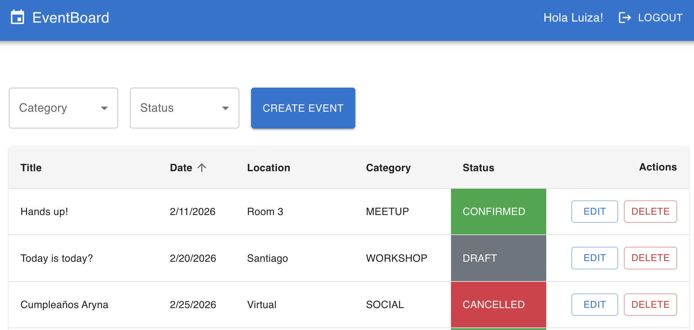

# Event Board - Monorepo

## Autor
Juan Sanhueza R.

## DESCRIPCIÓN GENERAL
Event Board es una aplicación de Full-stack para gestionar eventos internos dentro de un equipo. Está construida utilizando una arquitectura de microservicios con GraphQL Federation y Module Federation para el frontend.

Modalidad elegida: Opción A



### Adicionales
- GraphQL
- Autenticación JWT
- Docker
- Micro-frontend 
- Testing avanzado 

## Inicio Rápido

### Requisitos Previos

- Docker & Docker Compose
- Node.js 24+
- pnpm (npm install -g pnpm)

### Environment Files
- Copia `.env.example` to `.env` en cada servicio:
  - `packages/backend/eb-api-gateway/.env`
  - `packages/backend/eb-api-events/.env`
  - `packages/backend/eb-api-users/.env`
  - `packages/frontend/eb-web-app/.env`
  - `packages/frontend/eb-web-app-events/.env`
  - `packages/frontend/eb-web-app-users/.env`
Para pruebas locales, puedes usar los valores predeterminados en `.env.example`, pero asegúrate de cambiar `JWT_SECRET` a un valor fuerte para producción.

### Ejecución con Docker Compose

```bash
# Navegar al root de proyecto
cd event-board

# Ejecutar todos los servicios
pnpm dev:build

# O ejecutar sin reconstruir
pnpm dev

# Ver logs
pnpm logs

# Detener todos los servicios
pnpm down
```

## Arquitectura

### Backend (NestJS con GraphQL Apollo Federation)

- **eb-api-gateway**: Apollo Gateway / Router que compone esquemas desde subgrafos
  - [Federation (eb-api-gateway)](packages/backend/eb-api-gateway/README.md)

- **eb-api-events**: Microservicio subgrafo para Eventos
  - [eb-api-events](packages/backend/eb-api-events/README.md)

- **eb-api-users**: Microservicio subgrafo para Usuarios
  - [eb-api-users](packages/backend/eb-api-users/README.md)

### Base de Datos

- **MongoDB**: Base de datos de documentos con dos bases de datos separadas
  - `eb_events`: Contiene colección de eventos
  - `eb_users`: Contiene colección de usuarios

### Frontend (React con Module Federation)

- **eb-web-app**: Aplicación Host
  - [eb-web-app](packages/frontend/eb-web-app/README.md)

- **eb-web-app-events**: Módulo remoto para Eventos
  - [eb-web-app-events](packages/frontend/eb-web-app-events/README.md)

- **eb-web-app-users**: Módulo remoto para Usuarios
  - [eb-web-app-users](packages/frontend/eb-web-app-users/README.md)

## Estructura del Proyecto

```
event-board/
├── packages/
│   ├── backend/
│   │   ├── eb-api-gateway/       # Apollo Gateway
│   │   ├── eb-api-events/        # Subgrafo de Eventos
│   │   └── eb-api-users/         # Subgrafo de Usuarios
│   └── frontend/
│       ├── eb-web-app/           # Aplicación Host
│       ├── eb-web-app-events/    # Módulo Remoto de Eventos
│       └── eb-web-app-users/     # Módulo Remoto de Usuarios
├── scripts/
│   └── init-mongodb.js           # Script de inicialización MongoDB
├── docker-compose.yml             # Configuración Docker Compose
├── pnpm-workspace.yaml            # Configuración del espacio de trabajo pnpm
└── package.json                   # package.json raíz
```

## Flujo de Autenticación

1. Usuario navega a `/` en eb-web-app
2. Selecciona Registro o Inicio de Sesión en módulo eb-web-app-users
3. Credenciales enviadas a eb-api-gateway → subgrafo eb-api-users
4. Token de acceso JWT generado y almacenado en sessionStorage
5. Token de refresco almacenado en cookie HTTP-only segura
6. Token de acceso enviado con cada solicitud de API a eb-api-gateway

## Esquema de Base de Datos

### Colección de Eventos (base de datos eb_events)
```javascript
{
  _id: ObjectId,
  title: String,
  description: String,
  date: Date,
  location: String,
  category: Enum ['workshop', 'meetup', 'talk', 'social'],
  organizer: String,
  status: Enum ['draft', 'confirmed', 'cancelled'],
  createdAt: Date,
  updatedAt: Date
}
```

### Colección de Usuarios (base de datos eb_users)
```javascript
{
  _id: ObjectId,
  email: String (unique),
  name: String,
  password: String (hasheada),
  createdAt: Date,
  updatedAt: Date
}
```

## Validación de Datos

- **Nivel API Gateway**: Validación transversal para autenticación, autorización y validación de inputs comunes
- **Nivel Subgrafo**: Cada microservicio valida sus propios campos de esquema usando class-validator

## Variables de Entorno

Cada servicio tiene un archivo `.env.example`. Cópialo a `.env` y personaliza:

### Servicios Backend
- `NODE_ENV`: development/production
- `PORT`: Puerto del servicio
- `MONGODB_URI`: Cadena de conexión de la base de datos
- `JWT_SECRET`: Clave secreta para firmar JWT

### Servicios Frontend
- `REACT_APP_API_GATEWAY_URL`: Endpoint de GraphQL

## Testing

Cada servicio puede probarse independientemente. Los paquetes usan Jest para pruebas unitarias, integración y extremo a extremo; las aplicaciones frontend usan Jest + React Testing Library. Un servidor MongoDB en memoria se inicia automáticamente para integraciones de backend, por lo que no se requiere base de datos externa durante las pruebas.

```bash
# ejecutar pruebas en un paquete único
cd packages/backend/eb-api-events
pnpm test

# ejecutar todos los paquetes desde la raíz del espacio de trabajo
pnpm test            # ejecuta cada servicio secuencialmente
```

La cobertura se recopila por Jest y se escribe en directorios `coverage/` en cada paquete, más un informe de todo el espacio de trabajo en `coverage/lcov-report/index.html`. Se pueden agregar umbrales en `jest.config.ts` si es deseado.

Tipos de pruebas:

1. **Unitarias** – Archivos `.spec.ts` junto con código fuente usan `@nestjs/testing` o React Testing Library y mocks de jest.
2. **Integración** – Pruebas respaldadas por base de datos denominadas `.integration-spec.ts` acceden a una instancia MongoDB en memoria real (`mongodb-memory-server`).
3. **E2E** – Archivos `.e2e-spec.ts` inician una aplicación Nest, anulan guards, y ejercitan endpoints HTTP/GraphQL usando `supertest`.

Se agregan placeholders en paquetes sin pruebas reales para que Jest se cierre limpiamente.

## Consideraciones de Seguridad

1. Los tokens JWT expiran después de 1 hora
2. Los tokens de refresco duran 7 días
3. Las contraseñas se hashean usando bcryptjs
4. Los tokens de refresco almacenados en cookies HTTP-only
5. Los tokens de acceso almacenados en sessionStorage
6. CORS configurado para servicios Docker
7. Cambia JWT_SECRET en producción

## Tecnologías

### Backend
- NestJS
- GraphQL con Apollo Server & Federation
- MongoDB con Mongoose
- Bcryptjs para hashing de contraseñas
- JWT para autenticación

### Frontend
- React 18
- Material-UI (MUI)
- Module Federation (@module-federation/enhanced)
- Axios para solicitudes HTTP
- React Router para navegación

### DevOps
- Docker & Docker Compose
- Node.js 24
- MongoDB 7.0.5

## Mejoras Requeridas para Producción en AWS

### Infraestructura & CI/CD
- ❌ **GitHub Actions Workflow**: Pipeline a implementar en `.github/workflows/ci-cd.yml`
  - **Test stage**: Lint, type-check y tests en MongoDB in-memory (paralelo)
  - **Build stage**: 6 imágenes Docker en paralelo con caché
  - **Deploy stage**: Push a ECR y actualización de servicios ECS en main branch
  - Setup: Crear workflow YAML que ejecute `pnpm test`, `pnpm lint`, `docker buildx build` con triggers en push/PR
  - Secrets necesarios: `AWS_ACCESS_KEY_ID`, `AWS_SECRET_ACCESS_KEY`, `AWS_REGION`

- ❌ **AWS ECR**: Autenticación y push de imágenes Docker tras tests exitosos
  - Requer configurar IAM user con permisos `ecr:GetAuthorizationToken` y `ecr:BatchGetImage`
  
- ❌ **ECS Cluster**: Orquestación con Fargate o EC2 para 6 servicios
  - Health checks en `/health` (implementar en NestJS)
  - Auto-scaling por CPU/memoria
  - Load balancer (ALB) con sticky sessions para sessions

- ❌ **Infrastructure as Code**: Terraform para provisionar ECR, ECS, RDS, VPC, ALB
  - Variables: región, nombre cluster, tamaño instancias, scaling policies

- ❌ **RDS/DocumentDB**: Reemplazar MongoDB local por DocumentDB gestionado
  - Connection pooling con elasticache Redis para sesiones JWT

### Operacional & Observabilidad
- ❌ **Health Checks**: Endpoints `/health` y `/ready` para ALB/ECS
- ❌ **CloudWatch Logs**: Integración de logs centralizados
- ❌ **X-Ray/APM**: Trazabilidad distribuida entre microservicios
- ❌ **CloudWatch Alarms**: Alertas para CPU, memoria, errores

### Seguridad
- ❌ **AWS Secrets Manager**: Gestión de JWT_SECRET, credenciales BD y API keys
- ❌ **CORS Restrictivo**: Reemplazar `'*'` con dominios específicos
- ❌ **Rate Limiting**: Implementar en API Gateway para prevenir abuso
- ❌ **SAST/SCA**: SonarQube o Snyk en el pipeline CI
- ❌ **TLS/HTTPS**: Certificados ACM en prod
- ❌ **WAF**: AWS WAF en CloudFront/ALB

### Optimización & Escalabilidad
- ❌ **Load Balancer**: ALB con health checks y sticky sessions
- ❌ **Auto Scaling**: Políticas según CPU/memoria
- ❌ **CloudFront**: CDN para frontend y assets estáticos
- ❌ **Redis/ElastiCache**: Caching de sesiones y datos frecuentes
- ❌ **Optimización de Dockerfiles**: Multi-stage mejorado, especialmente backend
